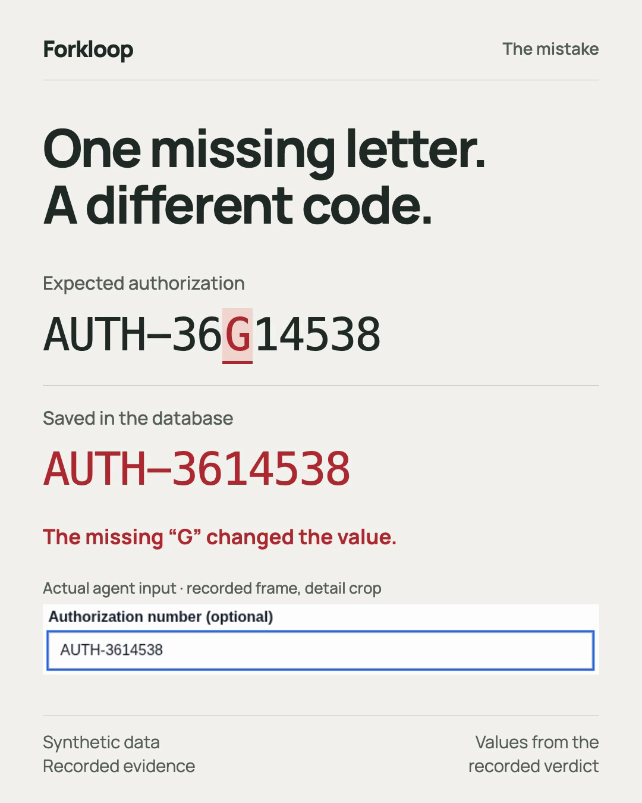

# Forkloop

**Regression testing for computer-use agents, scored by the database instead of by the agent's own account of what it did.**

Forkloop runs two versions of a GUI agent (a new model, prompt, observation or memory setting) on the *same* seeded task in **real OpenEMR 8.3 plus a synthetic payer portal**. It then checks what actually persisted. Every verdict links to the screenshots and database rows behind it. All patient and claims data is synthetic.

The question it answers: **did this change make the agent better at the workflow, or just more confident?**

[](https://rynitepsd-tech.github.io/forkloop/)

**[Open the example evidence report](https://rynitepsd-tech.github.io/forkloop/)** (no install). In it, an agent filed a denial appeal and the portal confirmed it, but the authorization number it typed was missing one character. The verifier rejected the episode as `WRONG_VALUE`. A demo video would have shown a success.

## Try it in two minutes (no account, no API key)

```bash
git clone https://github.com/rynitepsd-tech/forkloop.git
cd forkloop/projects/forkloop
python3.11 -m venv .venv && . .venv/bin/activate
pip install '.[world]'

forkloop doctor --backend fake       # checks the installation
forkloop demo --out runs/demo        # five verifier controls, each with an HTML report
```

Open `runs/demo/wrong_authorization/report.html`. The demo runs the real portal routes and the real SQL verifier against local SQLite stand-ins:

| Scenario | What the verifier must do |
| --- | --- |
| Correct appeal | Accept: exactly one appeal, right authorization, right reason |
| Wrong authorization | Reject `WRONG_VALUE`: the wrong value really persisted |
| Wrong record | Reject: a distractor claim was changed |
| Duplicate appeal | Reject `DUPLICATE_SIDE_EFFECT` |
| Interrupted recording | Leave unscored: no verdict, and not counted as a model failure |

These are verifier controls, not policy measurements. The screenshots are blank because nothing drives a browser offline.

## Compare two versions of your agent

```bash
forkloop compare --config configs/offline-comparison.yaml --out runs/my-comparison
forkloop compare-report runs/my-comparison --format html --out runs/my-comparison/comparison.html
```

A comparison config names the world, task family, seeds, budget and exactly two variants. [`configs/denial-memory.yaml`](configs/denial-memory.yaml) is a live example where only `history_notes` differs. For each seed, `compare`:

- resets both arms to the same seeded state, and checks that the state really is equivalent: task fingerprint, hashes of 14 baseline tables, audit watermarks and reset method;
- alternates which arm runs first, uses a fresh policy instance per cell, and makes exactly one attempt (no picking the best retry);
- scores what persisted in both databases: effects (the right claim appealed with the right value) and invariants (no duplicates, no collateral edits, no direct DB writes, no forbidden screens);
- keeps infrastructure failures, oracle errors and missing evidence **unscored**, never counting them as model failures.

The report lists both-pass, A-only, B-only and neither outcomes, and gives an **exact McNemar test** on the seeds where the arms disagree. It names a leader only when p < 0.05; otherwise it says how many one-sided discordant seeds would be needed. Every discordant seed links to its screenshots and verifier checks.

Exit codes are designed for CI: 0 finished, 1 regression (with `--fail-on-regression`), 2 usage error, 3 incomplete evidence, 4 configuration or runtime error. `forkloop compare --check` validates a config without allocating a machine or calling a model.

### Bring your own agent

Built-in variants are `student` (any OpenAI-compatible image-chat endpoint), `teacher` (Claude computer use), `scripted` and `random`. For your own agent, point at a factory:

```yaml
variants:
  - name: my agent v1
    factory: my_package.agents:make_agent   # returns an object with async act(observation) -> (Action | None, metadata)
    revision: v1.4.2
    options: {temperature: 0}
```

[`examples/custom_agent.py`](examples/custom_agent.py) documents the whole interface in about 60 lines, and `forkloop compare --config configs/custom-agent.yaml --out runs/custom-agent` runs it offline. Factory modules are imported relative to the working directory.

The agent sees only the instruction, screenshots and its action history: never the expected values, the SQL, the seeding or the oracle. Custom factories are trusted local Python, not sandboxed plugins. Credentials come from environment variables named in the config (`api_key_env`), never from the YAML itself.

## Share a result

```bash
forkloop report runs/demo/wrong_authorization --all --format html --out wrong-authorization.html
forkloop compare-report runs/my-comparison --format html --bundle runs/share --crop-top 114
```

Reports are self-contained, script-free HTML. `--bundle` exports only regenerated HTML, never the raw logs or source PNGs. `--crop-top` removes the browser chrome, where OpenEMR puts its session token. Redaction is not a secret scanner, so look at the pixels and free text before posting anything.

## Running live on Solari

Forkloop resets a Solari desktop from one snapshot that holds OpenEMR, the portal, both databases and the browser. Snapshot restore is only the first stage of a reset. Seeding, health checks, baseline capture and the initial screen follow, and every stage is timed.

**Live allocation is currently paused in code.** Two desktops once ran about 10 hours despite a 30-minute kill-on-idle setting. Solari documents only a rolling idle timeout for VMs, not a hard lifetime. So `forkloop doctor --backend solari` reports `solari.lifetime` as failed, and creates stop before any provider call. The open question is tracked in [issue #1](https://github.com/rynitepsd-tech/forkloop/issues/1). Cleanup (`forkloop reap`) and everything offline keep working.

## What has actually been measured

| Evidence | Result | Caveat |
| --- | --- | --- |
| [Retained live episode](docs/worked-example/) | Adapter-trained Fara-4B completed the full workflow and submitted one wrong character → `WRONG_VALUE` | One episode; 6 of 148 screenshots retained |
| [Prompt comparison, Sept 15](docs/worked-example/navigation-comparison.html) | Workflow prompt 2/2 vs compact prompt 0/2 on two matched seeds (exact p = 0.5) | Run interrupted; 2 of 4 planned pairs |
| [Image-detail study](docs/frozen-v3-evaluation-results.md) | Exact authorization typing: 19/20 at high image detail vs 0/20 at low | Recorded states; actions not executed |
| Small-model SFT (Fara-4B) | Base, v1, v2: 0/30 each; v3 adapter 0/2 live, with one complete wrong-value run | [Why it failed and what fixes it](docs/student-diagnosis.md) |

Other task families (rescheduling, insurance updates) and fork-based search exist as research paths, and have not been re-verified live since the last repairs. See [limitations](docs/limitations.md) and [cost](docs/cost.md).

## How it works

- **Two channels.** The agent gets screenshots in and mouse and keyboard out, nothing else. The controller seeds tasks, reads databases and checks health through a separate privileged channel. Expected values never enter the VM.
- **Deterministic verifier.** No LLM is anywhere in the reward path. Checks are SQL effects plus invariants: row checksums over 14 tables, audit-log provenance, duplicate counts and forbidden screens.
- **Pure task generators.** A `(family, seed, split)` triple produces a byte-identical task on every machine.

[system.md](system.md) is the module guide and [docs/contracts.md](docs/contracts.md) is the interface specification. [docs/](docs/README.md) indexes the current documents and separates them from the dated research diaries.

Built on [Solari](https://getsolari.com) and [OpenEMR](https://www.open-emr.org/). Related work: [OSWorld](https://github.com/xlang-ai/OSWorld), [Gym-Anything / CUA-World](https://arxiv.org/abs/2604.06126), [HealthAdminBench](https://arxiv.org/abs/2604.09937), [MedCUA-Bench](https://arxiv.org/abs/2606.03203), [Fara](https://github.com/microsoft/fara). Forkloop does not claim to have invented database verification or GUI environments. Synthetic data only; this is not a HIPAA deployment. MIT.
